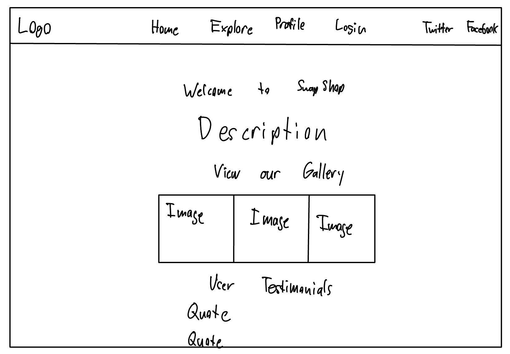
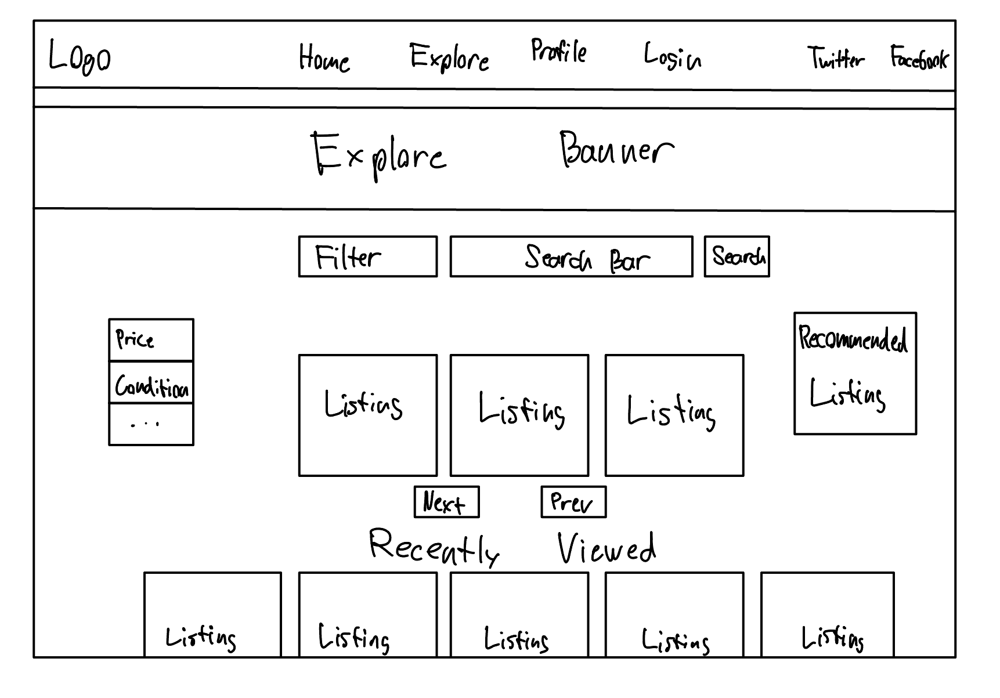
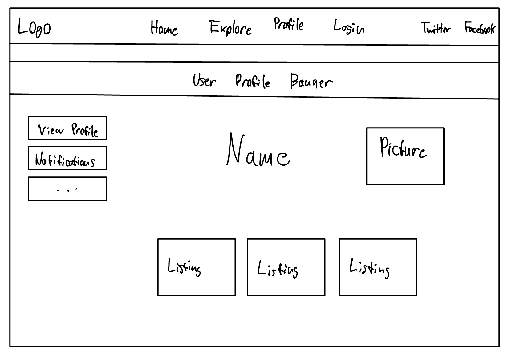
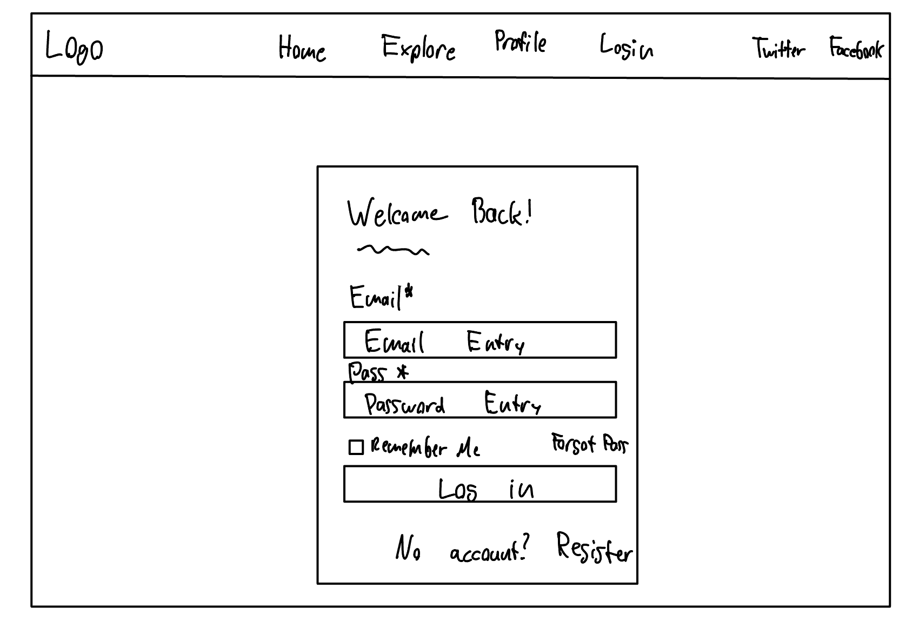
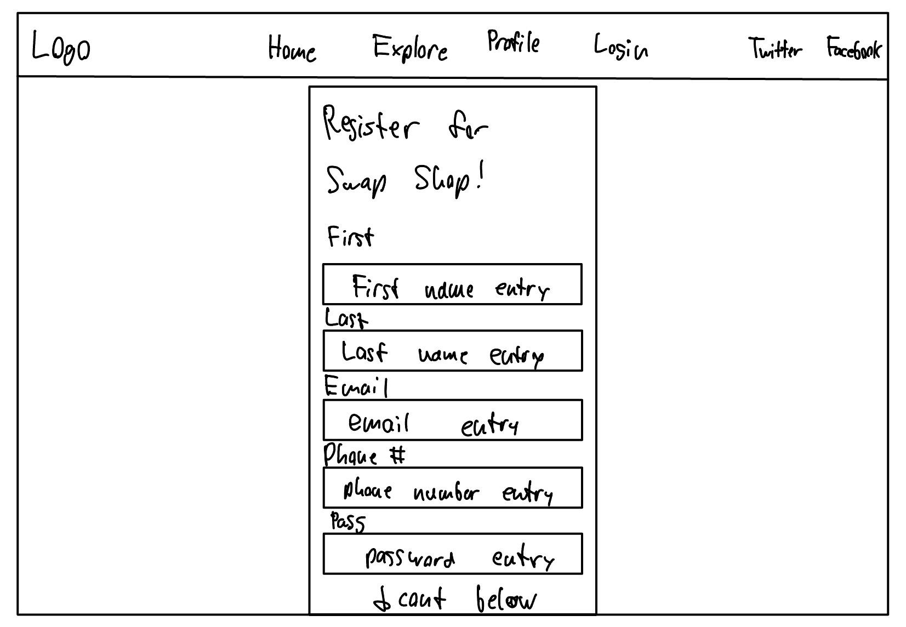
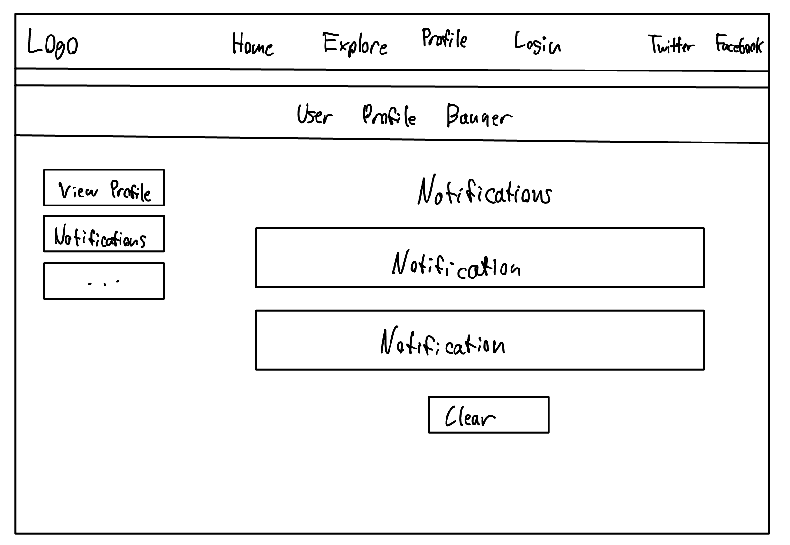
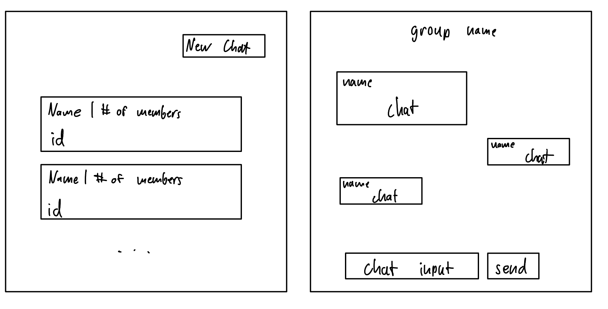
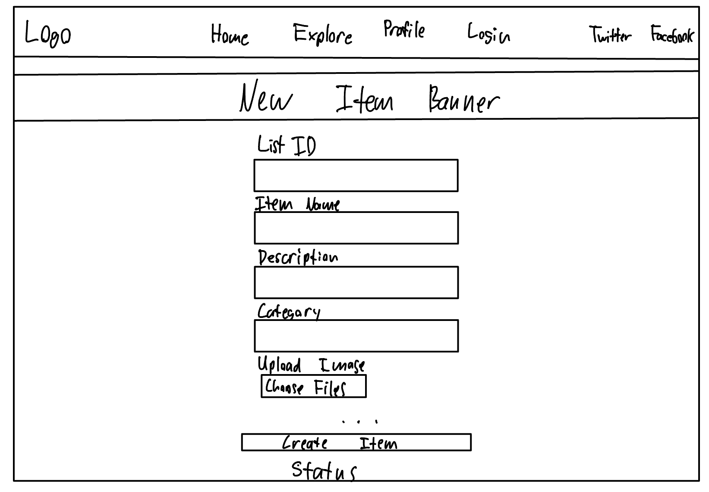
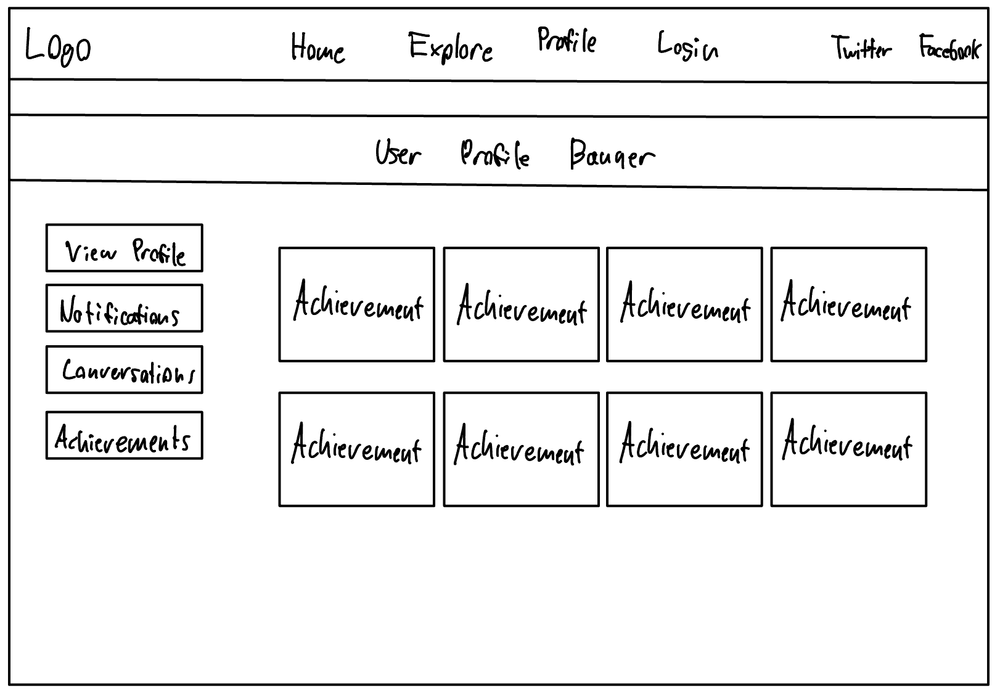

# UI Diagrams

Diagrams and explanations of the UI, including how users will interact with the interface.

## Home Page

### Description of the Home Page
- The home screen is the first screen users will see after logging into the application. The layout is designed to provide a quick overview of what we are, with a clean and simple interface that make it easy to understand.
- On this screen the user can interact with:
  1. Explore page which gives the all of the possible listing of the items
  2. Cart/Saved Items, here user can save the items they want to buy or the items they wish to buy in future.
  3. Profile Log-in button where user can login to there profile or can register if they do not have a profile.
- Use Case: Home page is a quick introduction of the web application. From this page a user can navigate to anywhere they want.

## Explore Page

### Description of the Explore Page
The **explore page** is the compilation of all items listed on our website. You will have a few items that are recommended for you at the top of the page based on past views, past purchases, and filters. Below that will be all other listings that will by default be filtered by most popular, but we have a sort-by option to specify how you want the listings to appear. Along with the sort by, you can also filter using the search bar for keywords to get the items you desire.
1. **Search and filtering:** You will be able to explore items that you want by searching for keywords, filtering by many filters such as popularity, distance, price, and relevancy. These will change the types of listings that will appear below on the page

2. **Listings:** The listings are a scrollable feature that users can browse through to explore possible items they are interested in. You can see a small picture of the item with the price and description, and if you were to click on it, it would bring you to that item's page listed above. Along with this, on the bottom, there is a recently viewed tab for the items you have just viewed.

3. **Use Case:** This will be the main part of the app, where the buyers can browse items. They can view all available listings nearby, and filter by their needs. This allows for a successful and compact place to view items that are typically spread around the UMass Snapchat story and other sources around campus. It will be an easy place for buyers to come and find items they need.

## Profile Page

### Description of the Profile Page
- The user can acces to the profile page by clicking on the button available on the top right corner.
- The Profile Page will display key information about the seller or buyer. It will feature a minimal yet intuitive design, showing the user's profile picture at the top, followed by their name, and bio. It will also contain tabs or sections to navigate between active listings (for sellers) or purchase history (for buyers).
- Sellers can update their listings, view ratings, and respond to messages, while buyers can track orders and leave feedback. Users can also edit their profile details. If accessed without login, the system redirects to the login page, ensuring secure access.
- User can see if they have any notifications by clicking the notification button.
  

## Item Page

### Description of the Item Page
The **Item page** will display our sellers' listings and allow buyers to browse items they are interested in. It is a minimalistic page with the title of the item, pictures of the items viewable by clicking through the middle, and more specifics on the details.
1. **Viewing of the item** - The user should be able to see multiple pictures of the item they are interested in by scrolling through the images uploaded by the seller including a big title above. The pictures are the main attraction of this page and we want the user to be able to view them easily both on the web and phone.

2. **Specific description of the item:** The page will include everything the user needs to know such as location, price, details about the seller, and a description of the item. These will be set by the seller, and the rating will be from the sellers page. The description will also be given from the seller with any further context needed.

3. **Message and save items:** These buttons will be available for the user to save items to their "Cart". and message the seller for buying details or more questions about the item. This will work very similar to Facebook marketplace, or any other swap app where we won't deal with the transaction but instead allow the buyer and seller to coordinate a time, place, and way of money transaction.

4. **Use Cases:** The use case for the item page is to engage the buyer with an item, get them more details, and connect them with the seller if they are interested in buying. It will allow for a deeper insight into the item so the buyer can be more assured they are getting the product they desire.

## Login Page

### Description for Login Page
The login popup screen will appear when users click on the login button on the upper right of any main page of the application.
On this popup users can enter in a username and password in order to access their account on the app. After entering in the details they can click the login button. This will verify credentials and then load user data. If they do not have an account a button is provided to open a registration screen where an account can be made.

## Register Page

### Description for Register Page
- The registration page will pop-up if the user does not have any account. In this page the user will enter their credentials like their name, email, password, and if they want a buyer's account or seller's or both. Once they hit register a personalized profile page will pop-up for them. 

## Notifications Page

### Description for Notifications Page
- The Notifications Page provides users with updates and alerts related to their account activity. It will be easily accessible by clicking the notification botton located on the profile page.
- The page will list notifications in chronological order, showing recent updates at the top. Notifications will include messages such as order confirmations, updates from sellers, item recommendations, messages from buyers or sellers, and any changes in the status of active listings.
- Use Cases: This page keeps users informed about their interactions and activities on the platform, ensuring they do not miss important messages or updates about their listings, purchases, or profile activity.

## Chat Hub and Chat Page

### Description for Chat Page
- The Chat Page provides a messaging platform within the application, enabling direct communication between buyers and sellers. It is accessible via the chat button on the profile page, it allows users to negotiate, ask questions, and arrange transactions efficiently.
- Messages are visually differentiated between sender and receiver for clarity.
- Users can type messages in Message Input Field and can send messages by clicking the send button.
- Use Cases:
  - Negotiation: Buyers and sellers can discuss and agree upon prices.
  - Inquiry: Buyers can ask for more details or request additional images of the item.
  - Transaction Coordination: Users can arrange meet-up times and locations for exchanging items.
  - Post-Purchase Communication: Discuss any post-sale questions or provide feedback.
 

## Create Item Page

### Description for Create Item Page

## Achievement Page

### Description for Achievement Page

