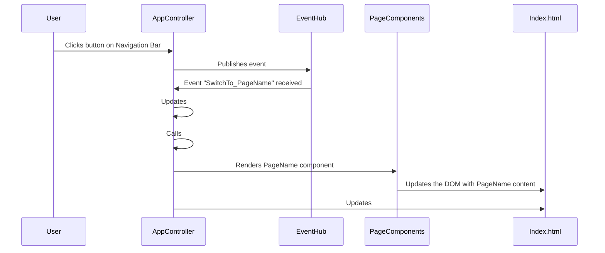

# Feature Sequence Diagram for the Navigation Bar 

### Description
The navigation bar allows users to access different page content when they click on the text for the corresponding page. Once the page the user wants is clicked on the navigation bar, then the div on the main page of the application is rendered with the page information for the corresponding page.

