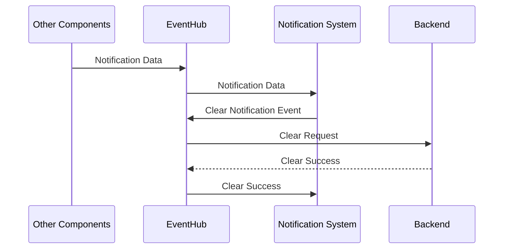

# Notification List

### Description:
This feature listens for notifications and posts them to the notification list in the profile page. It does so by listening to the event hub for a new notification, and then pulling the provided data into the screen. It also pushes out an event for if the notifications list should be cleared.

